# Comparing Unsupervised and Supervised Techniques for Instance-level Segmentation and Object Detection: Cityscapes Dataset
### Heriberto A Nieves, Daniel Enrique Martinez, Juan-Diego Florez-Castillo, Kartik Ramachandruni, Vivek Mallampati 

## Introduction

### Problem Definition

Image segmentation is the task of identifying individual objects in the image based on class, occurrence, and presence in either the foreground or background of the image. Our project explores instance segmentation, which combines object detection and semantic segmentation for foreground objects. Instance segmentation provides the necessary information about the scene---the class of each object, the frequency of each class, and pixel-level segmentation masks of objects.

### Background

There are numerous real world application to instance segmentation which make it an essential yet challenging research problem. For instance, the biomedical community relies on deep learning techniques to identify nuclei in electron microscopy images or to locate malignant cancer cells from CT scans; these act as acting as visual aids to perform more accurate diagnosis [1, 2].

Scene understanding is not possible without instance segmentation. By acquiring information about objects in an image, we can perform numerous computer vision tasks such as image captioning, video analysis and visual question answering [3].

Autonomous vehicle navigation also makes use of instance segmentation [4]. The navigation frameworks need to be able to distinguish between pedestrians, other vehicles, traffic symbols, and background objects. The planning algorithms should also further identify sub-classes of these objects in order to appropriately react to
situations while on the road.

### Related Work

Images of urban environments are often used to test novel deep learning techniques for segmentation. The Panoptic-DeepLab algorithm [5], for example, uses decoupled spatial pyramid pooling layers and dual decoder modules to simultaneously complete instance and semantic-level segmentation. The FASSST algorithm [6] performs real-time instance-level segmentation at video-grade speed by implementing an instance attention module to efficiently segment target regions and a multi-layer feature fusion model to obtain regions of interest and class probabilities. Works have also considered unsupervised learning techniques for image segmentation. For example, a Local Gaussian Mixture Model (GMM) with an additional penalty term and a local bias function has been used to segment noisy images affected by intensity-nonhomogeneity [7].

### Cityscapes Dataset

We used the Cityscapes dataset for this project [8]. Cityscapes is a collection of on-board vehicle data such as GPS, odometry, stereo images and disparity maps taken from drives of 27 cities along with annotations of street images using 30 visual classes. This dataset is abundant in examples with 5000 fine annotations and 20000 coarse annotations of urban street scenes. The dataset has also been extensively cited by prior work and there are numerous established benchmarks. We used raw images and the annotation images which contains rough, pixel-wise labels of objects in the scene.

Clustering algorithms are a group of unsupervised machine learning techniques which aim to group unlabelled data points according to similarities in their feature representations. Examples of clustering algorithms include the K-Means algorithm, GMM, and DBSCAN.

For our project, we implemented the K-Means and DBSCAN algorithms to perform pixel-level segmentation on raw images from the Cityscapes data set. To aid these techniques, we employed computer vision techniques to perform dimensionality reduction as well as extract meaningful feature representations of the image.

Since the aforementioned algorithms are unsupervised, we are unable to predict class labels for individual objects in the image. Instead, the objective of using these methods is to explore how traditional feature extraction combined with data-efficient clustering techniques performs on a complex image segmentation data sets such as Cityscapes. Cityscapes provides both non-sequential and sequential images, the latter of which presents opportunities for cross-image clustering, image classification by clustering, and feature extraction.

## Supervised Learning - Model Chaining

Supervised algorithms were performed using the fine annotations of the Cityscapes dataset. Two methods of completing pixel-level segmentation were completed. In this case, multiple objects are within the images. The first approach entails identifying the objects and finding the corresponding pixel for the object via model chaining. The second and more direct approach involves training on the pixel information and obtaining the pixel level map using deep neural network architecture. 

### Methods

**Method 1: Model chaining** involved using Google Colab to input raw, unlabeled (n=10) Cityscapes images, Fig. 1A, into the DEtection TRansformer (DETR) model (pre-trained on the COCO dataset) [12]. Each of the images were from the Nuremburg dataset. Primary outputs of the model include images with bounding boxes labeled, Fig. 1B, and a list of bounding boxes. DETR models were compared for performance and computation time to best select a model for use with the Segment My Object (SegMyO) pipeline. Based on Tables III, IV, and V (which will be expanded on later), the RESNET101-DC5 was selected. The architecture performed similar to that of the others, and has a greater resolution [12]. The model outputs were then inputted into the SegMyO which takes bounding box information and applies masks to the raw image using Mask R-CNN [13]. The entire model chain was completed for a total of 9 images from the Frankfurt dataset. A binary instance-level mask was outputted for each image and compared to the instance IDs provided by Cityscapes. The metric for this comparison was mIoU. 

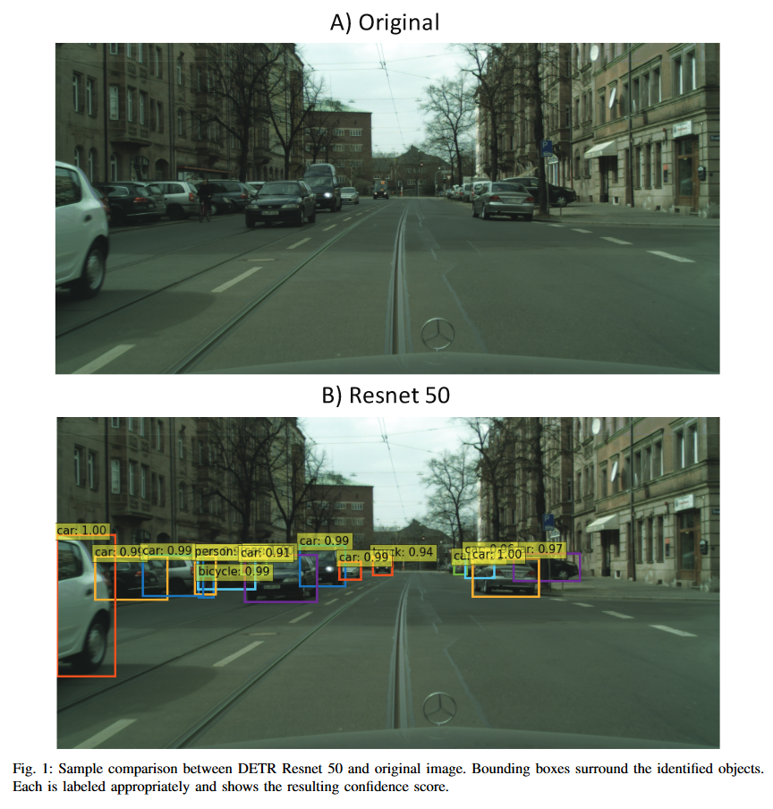

**Method 2: Deep Neural Network** utilizes the annotation masks to train models with architectures like RESNET50 or VGG-16 [14] for creating masks of object instances. The latest development of algorithms in CNN and DL pushed to create faster and lighter (computational) networks which create segmentation masks. We tested the pre-trained neural network models of DeepLab on the Cityscapes dataset and compare the pixel-level segmentation performances between various architectures [15]. One objective was to identify any performance advantages when using the transformers combined with neural networks. The models DeepLab [14] was implemented as an end to end pre-trained neural network on Cityscapes to compare different architectures and seeing qualitative measure comparisons. 

### Model Architecture Descriptions

1.  **DETR**: It approaches object detection as a direct set prediction problem. It consists of a set-based global loss, which forces unique predictions via bipartite matching, and a Transformer encoder-decoder architecture. Given a fixed small set of learned object queries, DETR reasons about the relations of the objects and the global image context to directly output the final set of predictions in parallel. Due to this parallel nature, DETR is very fast and efficient [16]. DETR uses ResNet as the intial neural network to extraac the image features. Then the image features are inputted it into the transformer which will give the bounding boxes for the recognized objects.

2.  **SegMyO**: It automatically extracts the segmented objects in images based on given bounding boxes. When provided with the bounding box, it looks for the output object with the best coverage, based on several geometric criteria. Associated with a semantic segmentation model trained on a similar dataset(PASCAL-VOC and COCO) this pipeline provides a simple solution to segment efficiently a dataset without requiring specific training, but also to the problem of weakly-supervised segmentation. This is particularly useful to segment public datasets available with weak object annotations coming from an algorithm (in our case DETR). Our implementation of the SegMyO model uses Mask R-CNN for segmenting the image in the bounding box, and the SegMyO algorithm chooses the mask of the main detected object neglecting the noise.

3.  **Panoptic-DeepLab**: It is a state-of-the-art box-free system for panoptic segmentation, where the goal is to assign a unique value, encoding both semantic label and instance ID, to every pixel in an image. The class-agnostic instance segmentation is first obtained by grouping the predicted foreground pixels (inferred by semantic segmentation) to their closest predicted instance centers. To generate final panoptic segmentation, we then fuse the class-agnostic instance segmentation with semantic segmentation by the efficient majority-vote scheme [15].
Panoptic-DeepLab adopts dual-context and dual-decoder modules for semantic segmentation and instance segmentation predictions. We apply atrous convolution in the last block of a network backbone to extract denser feature map. The Atrous Spatial Pyramid Pooling (ASPP) is employed in the context module as well as a light-weight decoder module consisting of a single convolution during each upsampling stage. The instance segmentation prediction is obtained by predicting the object centers and regressing every foreground pixel (i.e., pixels with predicted ‘thing‘ class) to their corresponding center. The predicted semantic segmentation and class-agnostic instance segmentation are then fused to generate the final panoptic segmentation result by the ”majority vote” proposed by DeeperLab [12].

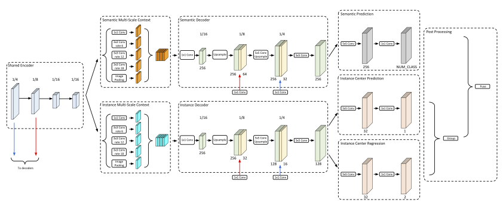

4.  **Axial-DeepLab**: It incorporates the powerful axial self-attention modules, also known as the encoder of Axial Transformers, for general dense prediction tasks. The backbone of Axial-DeepLab, called Axial-ResNet, is obtained by replacing the residual blocks in any type of ResNets with our proposed axial-attention blocks. They adopt the hybrid CNN-Transformer architecture, where they stack the effective axial-attention blocks on top of the first few stages of ResNets. This hybrid CNN-Transformer architecture is very effective on segmentation tasks [17]. An axial-attention block consists of two position-sensitive axial-attention layers operating along height- and width-axis sequentially. In the model we use, we have a full axial-attention block back-boned with ResNet50 to give better performance.
  
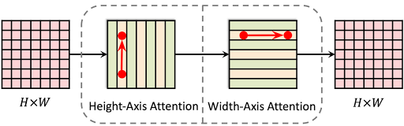

### Quantitative Metrics

1.  **Mean Intersection over Union (mIoU)** is another method to evaluate the predictions from an image segmentation model. This is a metric that takes the IoU over all of the classes and takes the mean of them. This is a good indicator of how well an image segmentation model performs over all the classes that the model would want to detect.

2.  **Computational Time** is an important metric of evaluation. The age of cloud computing, the focus of researchers are moving towards accuracy, but in reality compute is still scarce and is a matter of concern. Hence we will also be looking into determining time efficient methods by using the inbuilt tools to calculate.

3.  **Object count** is a metric of evaluation for the object recognition algorithm used in Method 1. The simple metric can help us keep on track and measure the performance of the algorithm.

### Metric Implementation
1. **SegMyO mIoU:** To calculate mIoU for the SegMyO, we used the ground truth images of Cityscapes "instanceIDImages" which have the instances in a mask. The challenge is the difference in the label IDs because the SegMyO algorithm was using a COCO training and the instances were stitched sequentially. We converted both the ground truth and the mask we got from SegMyO into binary masks (instance is 1, background is 0). Once we got both the masks, we calculated the mIoU to evaluate the images. Table I shows the values. The average mIoU is around 0.678 which means that most of the instances are being identified and the mask generated is close the actual ground truth. 

2. **DeepLab mIoU:**  To calculate mIoU for the DeepLab, we used the ground truth panoptic images of Cityscapes which have the labelled mask. Having both the masks, we calculated the mIoU to evaluate the images.  Table II shows the values. The average mIoU is around 0.79 which means that most of the instances are being identified and the mask generated is close the actual ground truth.

### Results

Definitions of the metrics used to report results in tables and images include:

1.  Total Run Time refers to the duration of the code per image iteration.

2.  Model Run Time refers to the duration of running the model per image iteration.

3.  Mean Score refers to the score per image iteration.

4.  Mean Score Per Car refers to the score of all the cars per image iteration.

5.  Cars Labeled refers to the number of cars labeled in the image.

6.  Items Labeled refers to the number of items labeled in the image.

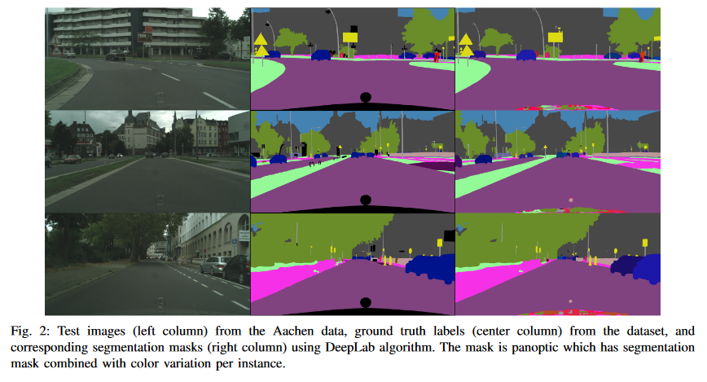

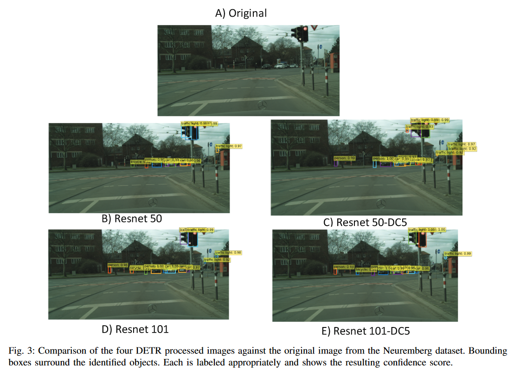

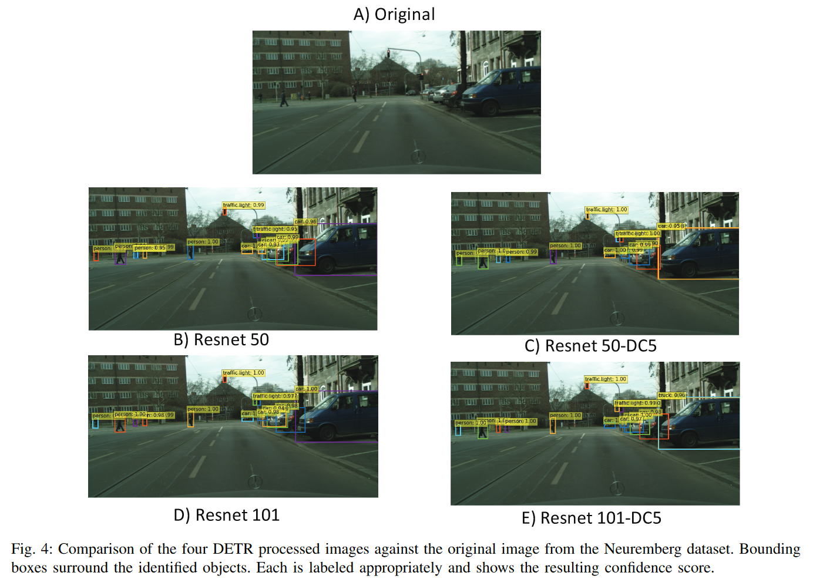

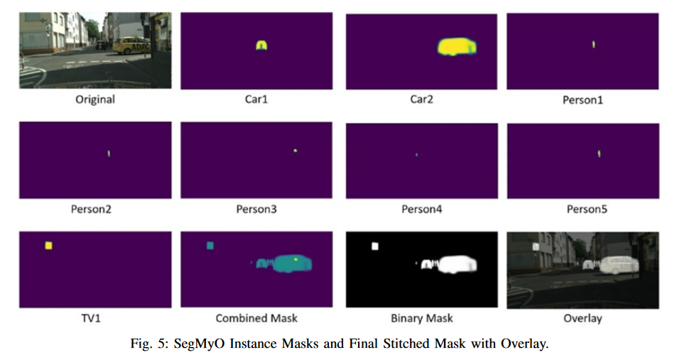

Fig. 1,3,4 help us qualitatively understand the impact of the DETR algorithm. The bounding boxes help recognize the objects in the Cityscapes dataset. This is particularly interesting as DETR was trained on COCO dataset and has not been trained on Cityscapes data before running it on validation. Only items identified by the DETR algorithms with confidence scores of 0.9 or above were kept.

Tables III, IV, V help us see which RESNET model is best and the comparison of the architecture helps us to make the best network with latest additions. A relatively constant duration of about 0.7 seconds was found across each DETR model based on the difference between Total Time and Model Time in Table I.

Fig. 5 provides an example of the SegMyO process run on a Frankfurt image. Each instance formed its own mask and was then stitched together into the Combined Mask. From here, a binary mask was created and overlayed on the original image to show which objects were segmented. 

Fig. 2 shows that DeepLab identifies all the semantic classes and all instances(additionally). Table IV shows that both Panoptic and Axial algorithms give an mIoU greater than 0.9 for Aachen dataset. Few of the images perform slightly better for Panoptic and others for Axial. We need to do more extensive testing on the total validation dataset to give a greater sense of impact of algorithms on data. In the future, we would like to optimize the architecture and see if smaller details can be better captured.

Qualitative analysis was performed on each of the Frankfurt images that was inputted into the Model chain. Fig. 6 shows that multiple instances were detected by the DETR model and were then segmented by SegMyO. Segmented instances range from cars, trucks, people, potted plants, benches, backpacks, and clocks. Labels associated with the instances were incorrect less than 5 times (i.e., a streetlight mislabeled as a TV). Instance IDs from the Cityscapes dataset were compared against the SegMyO outputs and an average mIoU of 0.70638 was found across all the images.

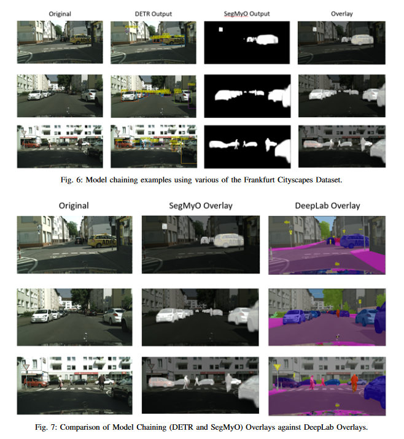

Fig. 7 compares the two supervised models and their respective overlays. It its important to note that the model chain resulted in an instance mask and the DeepLab model resulted in a panoptic mask.

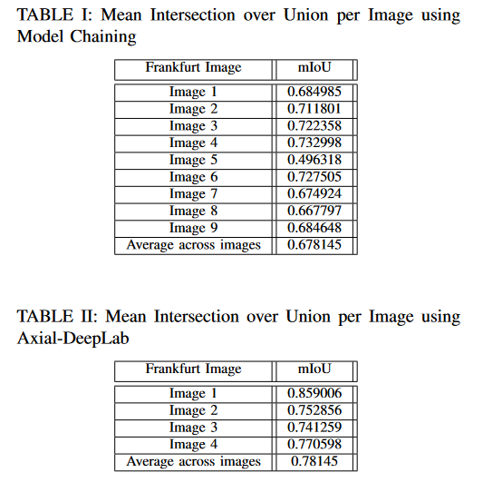
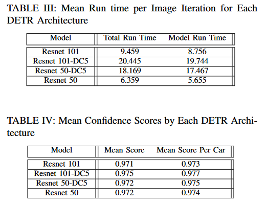
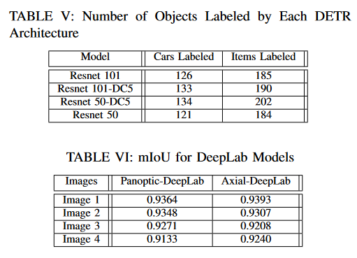

### Discussion

We observed that the DETR performance for smaller items increases with the DC-5 models as the resolution is increased by a factor of 2, correlating with increases in Items Labeled in Table III. On the down side, the DC-5 models have a higher computation cost because of the higher cost associated with self-attentions of the encoders, as shown in Table I. This observation matches with the claim made in the DETR paper [16].

Taking the unorthodox way, we combined two non-related models without linking them, but rather having the output of one be processed into being input for the other algorithm. We implemented the full Model Chaining approach where we passed the original image through DETR, and passed the output of DETR through SegMyO model which gave out a segmentation mask. The DETR output is bounding boxes of objects in an image, and the input for segmentation for SegMyO are also bounding boxes. We get object wise mask form SegMyO, and we stitch each object mask to create an image mask. 

We observe in qualitative measure that the edges are not fine and curves of the instances of classes in the image are not being clearly identified by the model chaining.

Future work will involve comparing the DETR models against each other image by image using all the metrics and also further qualitative analysis. This will aid in determining missed or incorrect labels. 
The DETR RESNET101-DC5 proved to be an acceptable choice for use with the SegMyO. An average of 0.789 mIoU across the Frankfurt images instance segmentation indicates the potential for the model chain to be further optimized for the Cityscapes dataset. Some limitations of the work is that item mislabeling can occur when a Cityscapes item is found to be similar to a COCO item detected by SegMyO. This occurred for street lights, for example, that in one instance was classified as a TV. Further model training can reduce this mislabeling.

DeepLab results, Fig. 2, clearly shows that the model is successful qualitatively and Table VI shows that the model is successful quantitatively, on average. The discussion for the DeepLab is between using different architectures. The RESNET-50 being backbone is a rather famous architecture, but we also extend our implementation to use the axial-transformers combined with ResNets. We are planning to run the model on the total validation dataset and complete the analysis on the DeepLab models trained on Cityscapes. Axial-DeepLabs performs better than the Panoptic-DeepLabs on aggregate, but the mIoUs and other metrics are relatively very close in our observation. We found in the literature that Axial-DeepLabs outperforms Panoptic-DeepLab by 1.2% Panoptic Quality (PQ) on the Cityscapes dataset [14]. In general, we see the end to end model to work better because the deep architecture enable the small features to be identified easily and training on the dataset makes the model detect better.

We could not train the deep neural network using the dataset because of compute limitations, but we strongly believe that making few architectural changes to train on Cityscapes, can make the neural networks yield higher performance. One future work is to create light weight neural network for segmentation such that it can be helpful in real world applications. 
## Unsupervised Learning - Clustering

### Classical K-Means

The K-Means algorithm, described in Eq. [1] was implemented on the Cityscapes raw images to perform pixel-based clustering. Given a set of observations, `X`, we want to group the observations into `k` sets, `S`, to minimize the in-cluster variance by operating using the in-cluster mean, .

We used the \"RGB\" color-space for clustering and used a resize operation to reduce the dimensions of the images to be clustered from 1024x2048x3 to a scaled pixel-wdith of 300. The a sample result set of the K-Means operation is shown in Fig. 8.

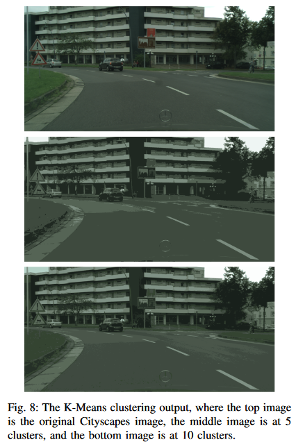

### HOG Feature Extraction

In order to reduce the dimensionality of the raw image data -- Cityscapes image dimensions are 1024x2048x3 -- and extract relevant feature representations from the images, we chose to generate a 'Histogram of Oriented Gradients', or HOG, descriptor for each image patch in the image. A HOG descriptor is a histogram of the image gradient orientation calculated from a localized image patch.

HOGs are popular image descriptors used to match key-points between images. They are more commonly used to generate features such as SIFT [9] and SURF [10]. HOG descriptors are also used in object detection methods by using these image descriptors along with supervised learning algorithms such as Support Vector Machines to perform object or human detection [11]. We aim to use these descriptors as input to unsupervised clustering techniques and observe the performance on pixel-wise image segmentation.

We now discuss the qualitative results obtained from using the K-Means algorithm.

#### HOG Features with K-Means

For the K-Means clustering method with HOG features, we selected the data of two cities to evaluate -- Aachen and Nuremberg. For each city, we selected 10 images to train the clustering algorithm and test on 3 images.

Prior to extracting HOG features, we convert the image to gray-scale and perform canny edge detection on the image. We observed a significant improvement in the quality of segmentation with these pre-processing techniques as well as a reduction in the Sum of Squares value for the same number of clusters.

To extract the HOG descriptors, we choose image patches of size (16, 16) with 4 cells in each image patch. We then generate a gradient histogram of 32 bins for each cell, resulting in a 128-length descriptor for each image patch. We also resize the image from 1024x2048 to 360x720 to reduce the computational cost of segmentation.

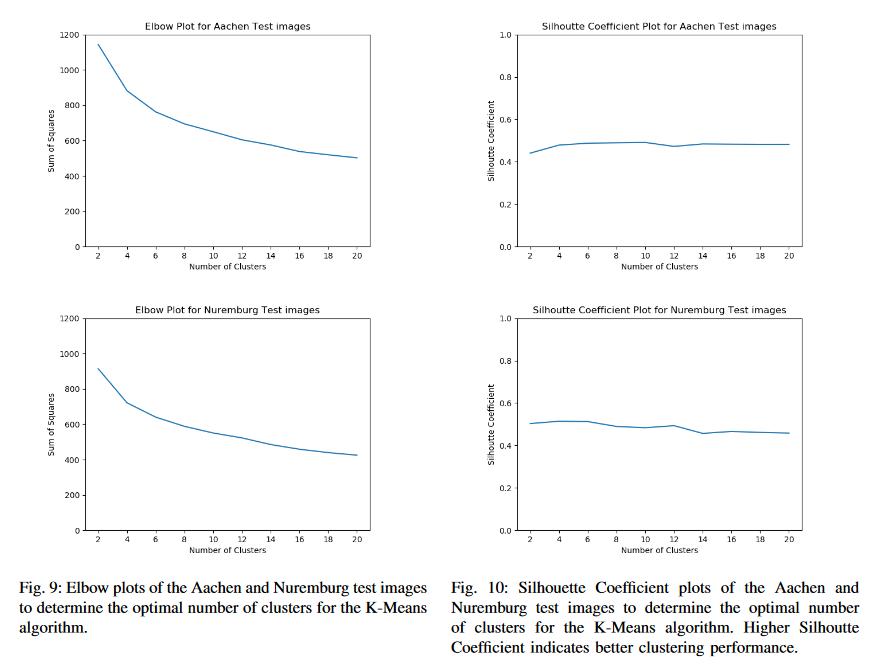

In order to determine the number of clusters, we first used the elbow method by plotting the Sum of Squares value calculated from test images versus the number of clusters. The elbow plots are shown in Fig 9. As the elbow plots did not provide any conclusive value for the ideal number of clusters, we also plotted the average silhouette coefficient of test samples for each clusters. The plots of average silhouette coefficients are shown in Fig 10. From these graphs, we find that the highest silhouette coefficients for the Aachen and Nuremberg data exist at 10 and 4 clusters respectively.

#### Qualitative Comparison and Discussion

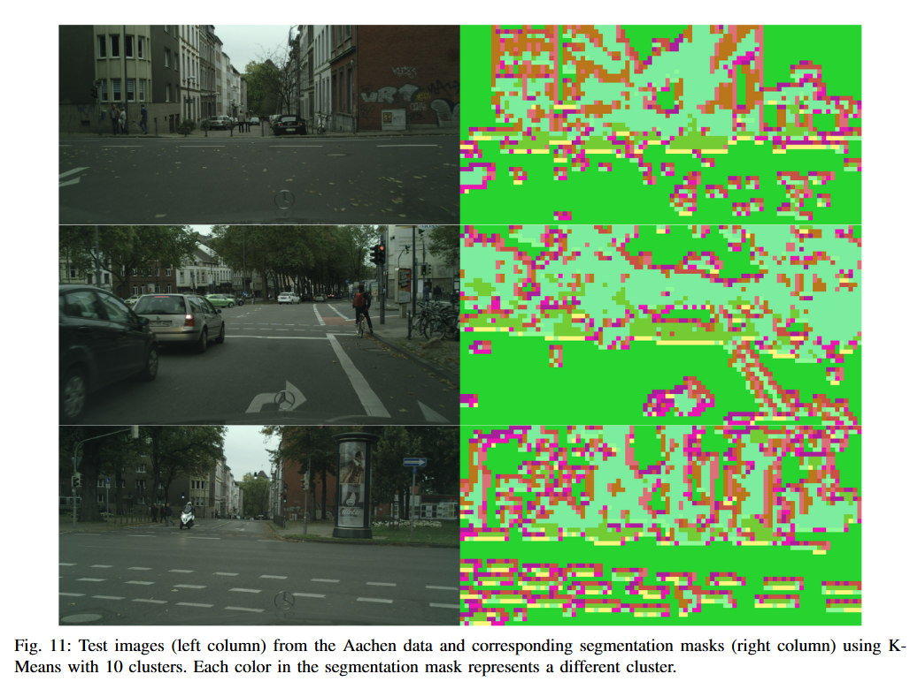

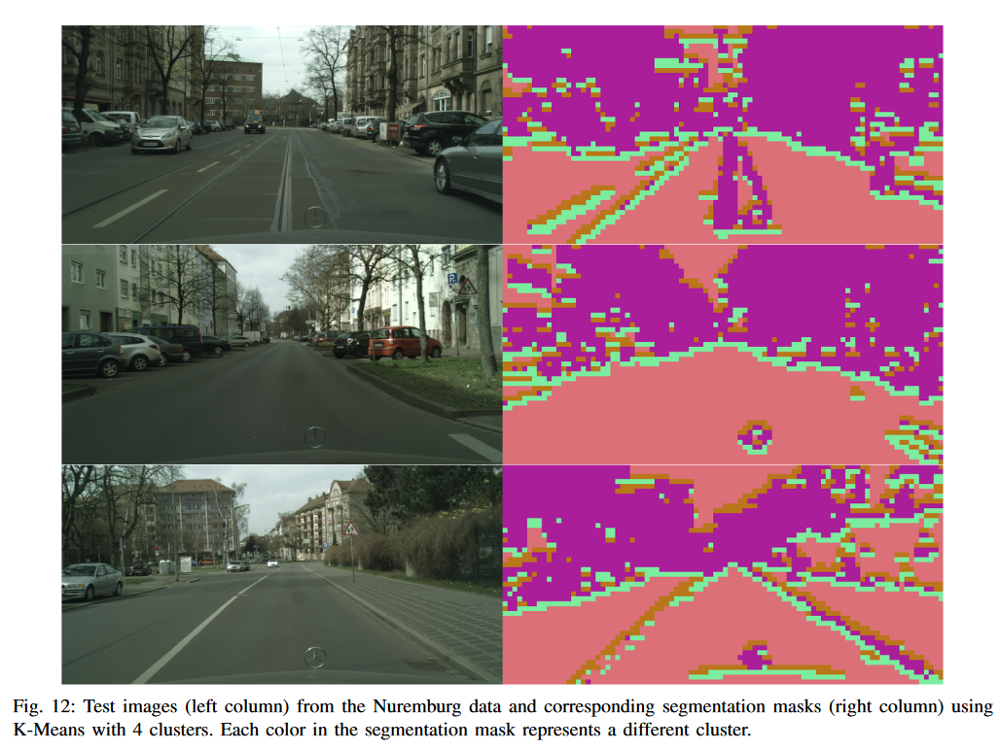

Figures 11 and 12 show the final segmentation masks obtained for each of the three test images taken from the Aachen and Nuremburg data. Looking at these images, we make the following observations: 

1.  The segmentation masks are very sensitive to edges and corners in the image. This is especially prominent in the Aachen images, where surface markings on the road are being separated from the road. This is mainly because the gradient of an image is very high at edges, corners and other sharp changes in image intensity due to which they tend to overpower the image descriptor.

2.  A consequence of the previous point is that cars that appear close together are merged with the background, particularly in the Nuremburg images. Objects appearing close to each other will not have a solid boundary around them. Therefore, the gradient of the image at that point is not strong enough for the clustering algorithm to separate the two objects from themselves and the algorithm instead combines that object with the background buildings.

3.  The segmentation masks make an effort to separate objects closer to the camera from the background in a few instances. For example, in the Nuremburg images, the road and nearby trees are distinctly separate from faraway cars and buildings. A possible application of this feature could be to use this kind of clustering to perform foreground extraction in images.

To summarize, we believe that performing unsupervised clustering either directly on the raw RGB images or on image descriptors, like HOG, is insufficient to perform meaningful pixel-level segmentation. To extend this approach, other low-dimensional feature representations of images need to be explored that can capture both local variations in pixel intensities as well as global information about which pixels belong to which object.

### DBSCAN

Density-based spatial clustering of applications with noise (DBSCAN) is a clustering method that groups together closely packed points. It divides points into three categories: core points, border points, and outliers. The clustering is based on two main parameters: Eps and MinPoints. Eps is the distance from a point for which the algorithm looks for nearby points to evaluate the density and MinPoints is the threshold for the number of points in the range defined by Eps necessary to mark a point as high or low density. Core points have more than the defined number of points in their neighborhood. Border points have less points than defined in their neighborhood but are in the neighborhood of a core point. Outliers are points that aren't core points or border points. Core points serve as the interior of clusters and border points as the edges of clusters.

In Figure 13 we show the results of DBSCAN clustering on 4 images from the Aachen data set. The clustering seems to separate the road in the images from the background objects. This is likely due to the large size of the road in the frame and it's uniformity in color making it easy to segment. The background has a lot of features and varying objects which all get grouped together as high density. Where the road is more clearly defined by borders and medians, the edges of the cluster of the road is preserved very well. In the images with more objects around the edges of the road, the division is not as clear.

We plan on comparing the performance of DBSCAN for object segmentation against K-means clustering and the raw images.

## Informing Supervised Object Detection using Unsupervised Clustering Techniques
### Methodology
The above sections discuss the individual unsupervised and supervised learning methods we investigated in this project. One key observation we derived from the qualitative unsupervised results is that the standalone clustering techniques we adopted were insufficient for the task of pixel-level segmentation. However, the clustering techniques were able to separate some entities in the image with low/moderate accuracy. We now investigate whether the information extracted by unsupervised clustering can be used to inform the supervised object detection method and possibly improve its performance.

We provide a qualitative comparison of whether using the clustered images from K-Means and DBSCAN would affect the object detection performance of the DETR model. For this comparison, we chose the classical K-Means clustering technique  with a k value of 5 and the DBSCAN clustering used in the previous section. We compare the following techniques: 1) DETR-RAW: Raw images are sent to the DETR object detector, 2) DETR-K-Means: Raw images are first clustered in the pixel space using K-Means clustering and the resulting clustered image is sent to the DETR object detector and 3) DETR-DBSCAN: Raw images are first clustered in the pixel space using DBSCAN clustering and the resulting clustered image is sent to the DETR object detector.

As the cityscapes dataset only has annotations for pixel-level segmentation, we used the pixel annotations to generate our own bounding boxes by drawing the smallest box around an object that encloses all pixels of the desired object. We then calculate the mean Intersection over Union (IOU) for each image as such: given a ground truth label and bounding box within an image, we find the prediction with the same predicted label and the highest IOU value. The IOU of a single image is obtained by averaging over the IOU values of all objects in the ground truth, and the mean IOU is the average IOU of all images in the test dataset. The following subsection presents a discussion of the results obtained from this comparison.

### Results and Discussion

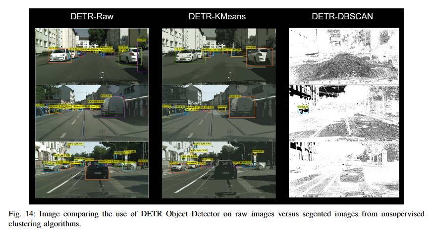

As shown in Fig. 14, there is a reduction in detected objects when using the unsupervised method output images instead of a raw image from the Cityscapes dataset. The DETR-K-Means images (at 5 clusters) have a reduced number of bounding boxes when compared to the raw image; however, they also have higher confidence values for certain detected objects. We can conclude that DETR works better with raw images than with preprocessed images, as its data preprocessing methods likely cannot account for aditional filtering or recoloring as with the K-Means output. A higher number of clusters would allow for increased number of objects detected, but this would also demand increased computation time for no practical benefit. Furthermore, the DETR-DBSCAN results clearly show an inability to recover any objects except a singular, mislabeled truck. The DBSCAN output image deviates too much from the raw image without providing any additional context for DETR to use.

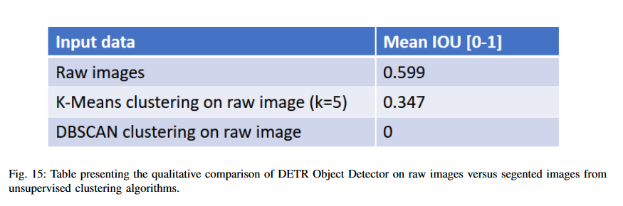

These trends are made clear in the table shown in Fig. 15. Mean IOU decreases as the image deviates more from the original, raw image. While DETR-K-Means was able to provide higher confidence values for some objects, other, more obvious objects were not detected by the algorithm (e.g. the car in the foreground of the bottom image). Thus, the noise introduced by the visual deviations from the raw image show that combining clustering methods with DETR in this manner is not beneficial.

## Conclusion
Object detection and instance segmentation are relevant and interesting problems to solve for autonomous navigation in urban environments. By applying supervised and unsupervised learning methods to image data, meaningful conclusions about the vehicles surroundings can be made and subsequently used to inform autonomous driving decisions. Five learning methods were used to complete instance segmentation – Supervised: (1) Model Chaining and (2) Deep Neural Network and Unsupervised: (3) K-Means Clustering of RGB Values, (4) K-Means Clustering of HoG Features, and (5) DBSCAN. 

Model chaining used DETR and SegMyO which were pretrained on the COCO dataset, limiting its overall instance-level mIoU to just above 0.68. In comparison, DeepLab was able to clearly complete panoptic segmentation and reached an mIoU of 0.79. The Deeplab was thus the better of the two supervised models. From the unsupervised methods, K-Means clustering of RGB values could not produce meaningful data beyond reducing the color complexity of the image by reducing the variability of RGB values within each cluster. In addition, K-Means clustering of HoG features showed some initial promise for foreground extraction; however, this needs to be paired with an additional method to truly accomplish this. Finally, DBSCAN showed potential for identifying the road in urban environment images; however, this would also need an additional method to create a label for pixels grouped in this way. Of the unsupervised methods, K-Means clustering of RGB values and DBSCAN were compared using DETR. Results showed that using the output images of these methods returned worse results than using the raw image values; likely due to the preprocessing that DETR uses. However, K-Means did perform better than DBSCAN, likely because it altered the images to a lesser degree. Ultimately, further training of the model chain, and parameter tuning of the DeepLab and unsupervised techniques can be completed to yield more accurate results.

## References
1. O. Ronneberger, P. Fischer, and T. Brox, “U-net: Convolutional
networks for biomedical image segmentation,” in International Confer-
ence on Medical image computing and computer-assisted intervention.
Springer, 2015, pp. 234–241.
2. D. Mzurikwao, M. U. Khan, O. W. Samuel, J. Cinatl, M. Wass,
M. Michaelis, G. Marcelli, and C. S. Ang, “Towards image-based
cancer cell lines authentication using deep neural networks,” Scientific
reports, vol. 10, no. 1, pp. 1–15, 2020.
3. W. Cai, Z. Xiong, X. Sun, P. L. Rosin, L. Jin, and X. Peng, “Panoptic
segmentation-based attention for image captioning,” Applied Sciences,
vol. 10, no. 1, p. 391, 2020.
4. D. de Geus, P. Meletis, and G. Dubbelman, “Single network panoptic
segmentation for street scene understanding,” in 2019 IEEE Intelligent
Vehicles Symposium (IV). IEEE, 2019, pp. 709–715.
5. B. Cheng, M. D. Collins, Y. Zhu, T. Liu, T. S. Huang, H. Adam, and
L.-C. Chen, “Panoptic-deeplab: A simple, strong, and fast baseline for
bottom-up panoptic segmentation,” in Proceedings of the IEEE/CVF
conference on computer vision and pattern recognition, 2020, pp.
12 475–12 485.
6. Y. Cheng, R. Lin, P. Zhen, T. Hou, C. W. Ng, H.-B. Chen, H. Yu, and
N. Wong, “Fassst: Fast attention based single-stage segmentation net
for real-time instance segmentation,” in Proceedings of the IEEE/CVF
Winter Conference on Applications of Computer Vision, 2022, pp.
2210–2218.
7. J. Liu and H. Zhang, “Image segmentation using a local gmm in a
variational framework,” Journal of mathematical imaging and vision,
vol. 46, no. 2, pp. 161–176, 2013.
8. M. Cordts, M. Omran, S. Ramos, T. Rehfeld, M. Enzweiler, R. Be-
nenson, U. Franke, S. Roth, and B. Schiele, “The cityscapes dataset
for semantic urban scene understanding,” in Proceedings of the IEEE
conference on computer vision and pattern recognition, 2016, pp.
3213–3223.
9. D. G. Lowe, “Object recognition from local scale-invariant features,”
in Proceedings of the seventh IEEE international conference on
computer vision, vol. 2. Ieee, 1999, pp. 1150–1157.
10. H. Bay, T. Tuytelaars, and L. V. Gool, “Surf: Speeded up robust
features,” in European conference on computer vision. Springer, 2006,
pp. 404–417.
11. N. Dalal and B. Triggs, “Histograms of oriented gradients for human
detection,” in 2005 IEEE computer society conference on computer
vision and pattern recognition (CVPR’05), vol. 1. Ieee, 2005, pp.
886–893.
12. N. Carion, F. Massa, G. Synnaeve, N. Usunier, A. Kirillov, and
S. Zagoruyko, “End-to-end object detection with transformers,” in
European conference on computer vision. Springer, 2020, pp. 213–
229.
13. R. Del ́earde, C. Kurtz, P. Dejean, and L. Wendling, “Segment my
object: A pipeline to extract segmented objects in images based on
labels or bounding boxes.” in VISIGRAPP (5: VISAPP), 2021, pp.
618–625.
14. L.-C. Chen, G. Papandreou, I. Kokkinos, K. Murphy, and A. L. Yuille,
“Deeplab: Semantic image segmentation with deep convolutional
nets, atrous convolution, and fully connected crfs,” 2016. [Online].
Available: https://arxiv.org/abs/1606.00915
15. B. Cheng, M. D. Collins, Y. Zhu, T. Liu, T. S. Huang, H. Adam, and
L.-C. Chen, “Panoptic-DeepLab: A simple, strong, and fast baseline
for bottom-up panoptic segmentation,” in CVPR, 2020.
16. N. Carion, F. Massa, G. Synnaeve, N. Usunier, A. Kirillov, and
S. Zagoruyko, “End-to-end object detection with transformers,” 2020.
[Online]. Available: https://arxiv.org/abs/2005.12872
17. H. Wang, Y. Zhu, B. Green, H. Adam, A. Yuille, and L.-C. Chen,
“Axial-DeepLab: Stand-alone axial-attention for panoptic segmenta-
tion,” in ECCV, 2020.
